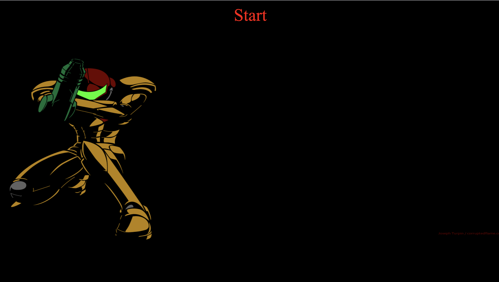

# TriviaGame

This is a simple trivia game about Nintendo. Load it up click start and answert the questions.
https://jjferg.github.io/TriviaGame/

## Over View
- Front End Application
- HTML  is minimal. A Div container is used to house the elements. A form element with input for user.
- BootStrap is use for organizing purposes.
- CSS used for styling purposes.
- Javascript/Jquery are used for functionality.

## How to install this app on your computer(local)
1. Under the repository name, click Clone or download.
2. In the Clone with HTTPs section, click to copy the clone URL for the repository.
3. Open Git Bash.
4. Change the current working directory to the location where you want the cloned directory to be made.
5. After install in the terminal run: NPM install to download all the neccesarry packeges for the app.
6. Link to [Install Instructions](https://help.github.com/en/github/creating-cloning-and-archiving-repositories/cloning-a-repository)

 ## Start Screen Display

